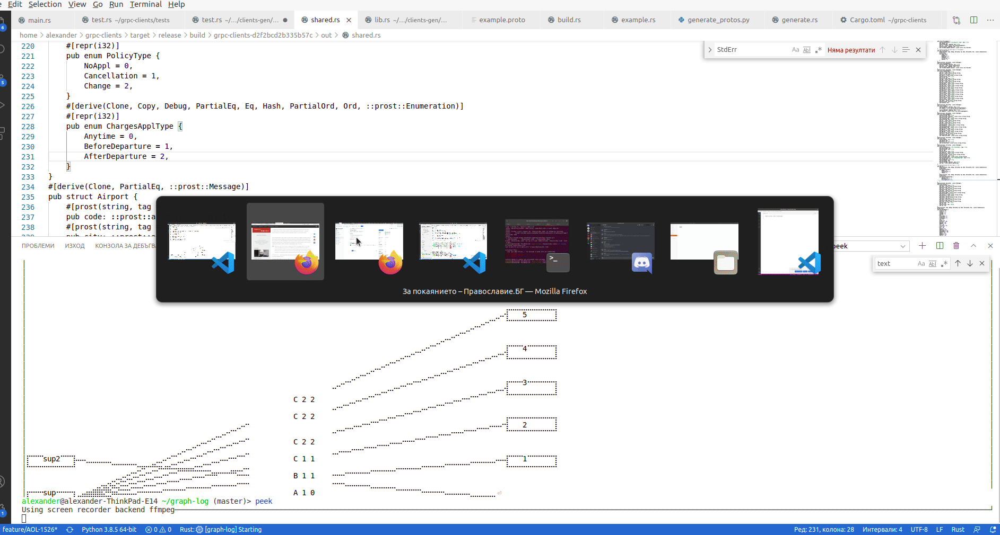

graph-log
----------

A graph logging tool for terminal/consoles.

Written initially while the author was working at his last job with the goal of logging and visualizing code there, so credit to the company for letting me work on that and open source it. 

Also influenced by previous work in Metacraft Labs, and general debugging ideas discussed with @zah .

Written in rust language using `tui-rs` and `termion` libraries.


usage
-----

```bash
#maybe TODO
graph-log
# TODO
#graph-log <log>
```



todo
-----

* features: stepping, more types of visualization
* client libraries for different languages
* document, bugfix, cleanup!

license
-----

MIT License

contributing
-----

Contributors are welcome!
